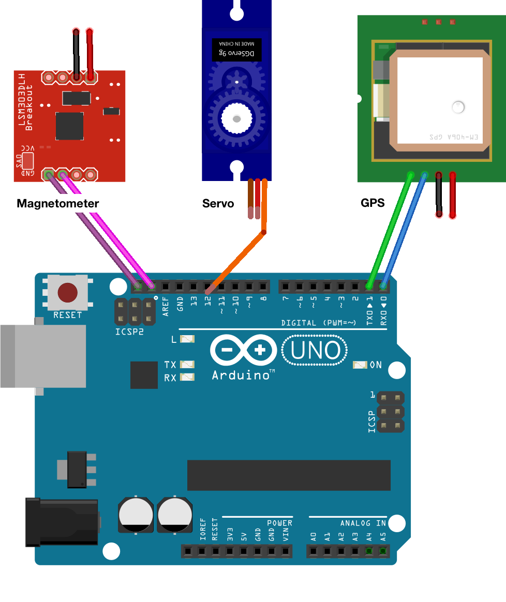

# Smart Compass

## Tl;dr
Connecting a megnetometer (compass), a gps module, and a servo to an Arduino. 

Servo (preferably with a big fat red arrow attached to it) points you towards your hotel, baked into the device as fixed gps coordinates.

## Components
- Arduino Uno
- Magnetometer
  - LSM303
  - [Unified sensor driver for Adafruit's LSM303 Breakout](https://github.com/adafruit/Adafruit_LSM303DLHC)
- GPS Module
  - [GPS Module SKU:TEL0094](https://www.dfrobot.com/wiki/index.php/GPS_Module_With_Enclosure_(SKU:TEL0094))
  - [TinyGPS++ library](https://github.com/mikalhart/TinyGPSPlus)
- Servo
  - [Sub-micro Servo - SG51R](https://www.adafruit.com/product/2201)
  - [Servo Library (built in)](https://www.arduino.cc/en/Reference/Servo)
